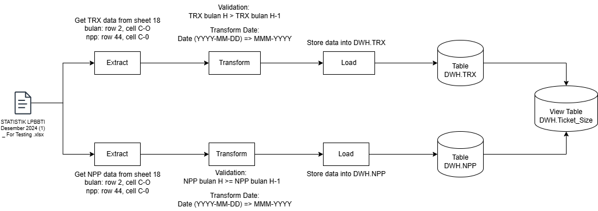

# 🛠️ AFPI Recruitment Test Project

This project is built to demonstrate a complete data pipeline extraction and transformation to loading into a data warehouse, and finally visualizing the result, as part of a take home test.

## 📌 Project Structure

```
project-root/ 
├── data-pipeline/
│ ├── dags/ # DAG definitions for ETL processes 
│ ├── logs/ # Airflow logs 
│ ├── ddl/  # Data definitions for databases
│ ├── data/ # Input data file 
│ ├── docker-compose.yml 
│ ├── docker-compose.yml 
│ └── requirements.txt
├── data_visualization/
│ ├── visualize.py 
│ └── requirements.txt
├── result/
├── screenshot/
└── README.md # This file
```

- The `data-pipeline` directory contains the Airflow Dags, Docker configs, logs code for data pipeline.
- The `data-visualization` directory contains the python scripts to visualize data ticket.
- The `result` contains exported data csv from database after data pipeline running sucessfully.
- The `screenshot` contains image file. 

## ⚙️ Data Model 


## ⚙️ Data Pipeline 



- **Extract**: Data is collected from xlsx file.
- **Transform**: Data is transformed and validated using custom Python logic in DAGs.
- **Load**: Transformed data is loaded into a **PostgreSQL** data warehouse.

## 🚀 Run the Project

### 1. Prerequisites

- Docker version 27.4.0 (https://www.docker.com/)
- Python 3.10.12

### 2. Run Airflow with Docker Compose

Navigate to the `data-pipeline/` directory and run docker container:

```bash
cd data-pipeline
mkdir logs
docker compose up airflow-init
docker compose up --build
```

### 3. Update Airflow Connection

Go to url:http://localhost:8080

1. Login using this account (username:irsyad, Password:irsyad-afpi-test)
2. Click on Admin Navbar → Select Connections
3. Click on '+' to add new connection
4. Fill connections:
    - Connection Id: afpi-recruitment-test-conn
    - Connection Type: Postgres
    - Host: postgres
    - Database: db-afpi-recruitment-test
    - Login: irsyad
    - Password: irsyad-afpi-test
    - Port: 5432

### 4. Run Dags

1. Click on DAGs Navbar
2. Click Action ▶ on the left list to run ETL DAG

### 5. Run Data Visualization Scripts

Navigate to the `data-visualization/` directory and run python code:

```bash
cd data-visualization
pip3 install -r requirements.txt
python3 visualize.py
```

## 📊 Result

### Data Visualization


### Data CSV

Deliverable csv can be seen in directory result.

